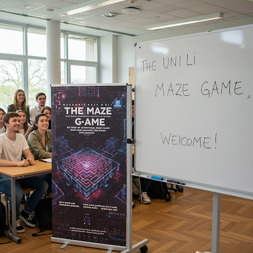
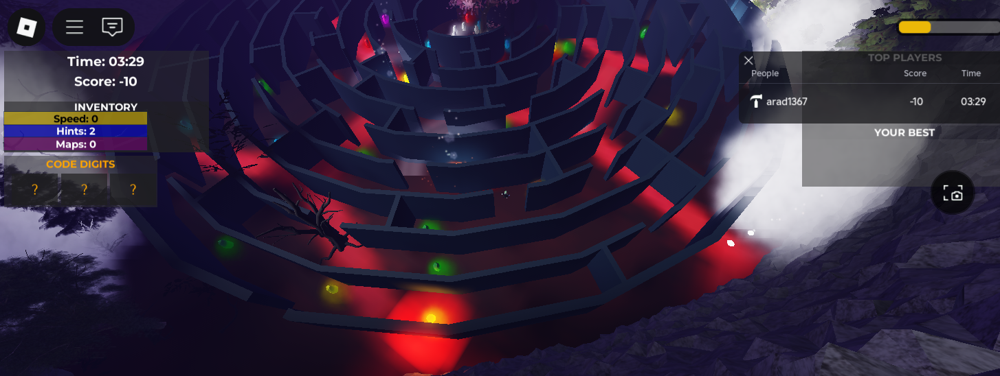

# "The Maze" & "The Pejman Maze Educational Game"

  

  
  
  

  

## Table of Contents
- [Introduction](#introduction)
- [Game Features](#game-features)
- [Gameplay Screenshots](#gameplay-screenshots)
- [Educational Value](#educational-value)
- [Technical Implementation](#technical-implementation)
- [Installation](#installation)
- [How to Play](#how-to-play)
- [Development Team](#development-team)
- [Contact](#contact)
- [License](#license)

## Introduction

"The Maze Educational Game" is an innovative educational game developed to make learning about artificial intelligence, AI Management, Strategy and Governance, deep learning, and machine learning concepts engaging and interactive. Set in a challenging maze environment, players must navigate through various obstacles, answer AI-related questions, and solve puzzles to successfully complete the maze.

This project was developed at the University of Liechtenstein under the guidance of Professor Johannes Schneider in the Department of Information Systems & Computer Science.

👉 **[Play the game now on Roblox!](https://www.roblox.com/games/99861417854484/The-Maze)** 👈

  

## Game Features

- **Interactive Maze Navigation**: Navigate through a complex, dynamically generated maze
- **AI Knowledge Questions**: Answer questions about machine learning, neural networks, and AI concepts
- **Collectible Power-ups**:
  - 🟢 **Green Emeralds**: Test your AI knowledge with quiz questions to earn points
  - 🟡 **Yellow Emeralds**: Collect speed boosts to move faster through the maze
  - 🔵 **Blue Emeralds**: Gather hint tokens to help with difficult questions
  - 🟣 **Purple Emeralds**: Obtain temporary map views to aid navigation
  - 🟠 **Orange Emeralds**: Find the 3-digit door code needed to unlock passages
- **Challenging Obstacles**:
  - ⭐ Falling stars that reduce player health
  - 🔴 Red emeralds that drain health on contact
  - 👹 Monster that roams the maze and must be avoided
- **Door Code System**: Find and remember the 3-digit code from orange emeralds
- **Leaderboard System**: Track your scores and completion times
- **Safe Zones**: Protection from dangers while answering questions

## Gameplay Screenshots

  
  

  
  

  
  

  
  

  

  
  

## Educational Value

This game serves as an educational tool designed to:
- Reinforce understanding of AI and machine learning concepts
- Encourage critical thinking and problem-solving skills
- Provide an engaging way for students to test their knowledge
- Create a fun learning environment that motivates continued exploration of AI topics

The educational content focuses on:
- Machine learning algorithms and techniques
- Neural network architectures
- AI terminology and concepts
- Data science fundamentals
- Practical applications of AI

## Technical Implementation

The game is built using Roblox Studio with Lua scripting. The main components include:

- **GameManager.lua**: Handles player data management, leaderboards, and game state
- **EmeraldHandler.lua**: Manages interactive emeralds that trigger AI quiz questions and power-ups
- **PlayerController.lua**: Controls player UI, inventory, and client-side interactions
- **DoorScript.lua**: Manages door behaviors for success/failure conditions
- **FallingStarsHandler.lua**: Controls the challenging falling star obstacles
- **BackgroundMusic.lua**: Manages game audio and atmosphere

The game leverages the Roblox platform's capabilities for:
- 3D environment rendering
- Multiplayer functionality
- Physics simulations
- Data persistence
- User interface components
- online chat and audio interactions

## Installation

To play the game:
1. Create a Roblox account if you don't already have one
2. Download the free Roblox Player from [Roblox.com](https://www.roblox.com/download)
3. Access the game directly via this link: [The Maze](https://www.roblox.com/games/99861417854484/The-Maze)
4. Click Play to start the game for free

To examine or modify the source code:
1. Download and install Roblox Studio
2. Clone this repository
3. Open the .rbxl file in Roblox Studio

## How to Play

1. **Navigate the Maze**: Use WASD or arrow keys to move through the maze
2. **Collect Emeralds**:
   - Green emeralds test your AI knowledge with questions
   - Yellow emeralds give you temporary speed boosts
   - Blue emeralds provide hint tokens for difficult questions
   - Purple emeralds show a map view briefly
   - Orange emeralds reveal digits of the door code
3. **Answer Questions**: When you encounter a green emerald, answer the AI-related questions correctly to earn points
4. **Find the Exit**: Navigate to the exit door using the clues and knowledge you've gathered
5. **Avoid Dangers**: Watch out for falling stars, red emeralds, and the monster
6. **Use Power-ups Wisely**: Access your inventory to use collected power-ups strategically

## Development Team

**Lead Developer & Researcher:**
- **Dr. Pejman Ebrahimi** - Postdoctoral Researcher, University of Liechtenstein

**Academic Supervisor:**
- **Professor Johannes Schneider** - Department of Information Systems & Computer Science, University of Liechtenstein

## Contact

For questions, feedback, or collaboration opportunities, please contact:

**Dr. Pejman Ebrahimi**  
Email: pejman.ebrahimi@uni.li  
Postdoctoral Researcher  
University of Liechtenstein  
Department of Information Systems & Computer Science

## License

This project is licensed under the MIT License - see the LICENSE file for details.

---

  
© 2025 University of Liechtenstein. All rights reserved.

